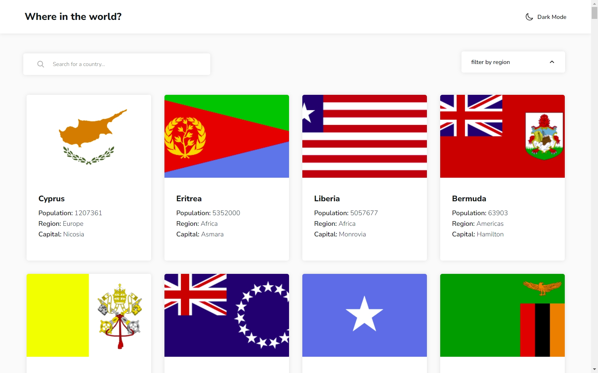

# Frontend Mentor - REST Countries API with color theme switcher solution

This is a solution to the [REST Countries API with color theme switcher challenge on Frontend Mentor](https://www.frontendmentor.io/challenges/rest-countries-api-with-color-theme-switcher-5cacc469fec04111f7b848ca). Frontend Mentor challenges help you improve your coding skills by building realistic projects.

## Table of contents

- [Frontend Mentor - REST Countries API with color theme switcher solution](#frontend-mentor---rest-countries-api-with-color-theme-switcher-solution)
  - [Table of contents](#table-of-contents)
  - [Overview](#overview)
    - [The challenge](#the-challenge)
    - [Screenshot](#screenshot)
    - [Links](#links)
  - [My process](#my-process)
    - [Built with](#built-with)
    - [What I learned](#what-i-learned)
    - [Continued development](#continued-development)
  - [Author](#author)

## Overview

This project is a solution to the REST Countries API with color theme switcher challenge on Frontend Mentor. The goal was to create a web application where users can explore countries using data from the REST Countries API and toggle between light and dark modes.

### The challenge

Users should be able to:

- See all countries from the API on the homepage
- Search for a country using an `input` field
- Filter countries by region
- Click on a country to see more detailed information on a separate page
- Click through to the border countries on the detail page
- Toggle the color scheme between light and dark mode *(optional)*

### Screenshot

### Links

- [Solution URL](https://github.com/jen67/Frontendmentor-challenges2/tree/main/RestApi)
- [Live Site URL](https://rest-countries-mu-two.vercel.app/)

## My process

### Built with

- Semantic HTML5 markup
- CSS custom properties
- Flexbox
- Mobile-first workflow
- JavaScript

### What I learned

This challenge introduced me to the process of integrating JSON files and APIs. Despite its initial difficulty, I successfully implemented fetching data from an API and updating a JSON file with it. Additionally, I learned how to handle API connection failures gracefully, ensuring that the site can still function using data from the JSON file.

### Continued development

In future projects, I aim to further enhance my JavaScript skills and expand my knowledge by building CRUD applications.

## Author

- Linkedin - [Gift Amachree](https://www.linkedin.com/in/gift-amachree-8a523623b/)
- Frontend Mentor - [@jen67](https://www.frontendmentor.io/profile/jen67)
- Twitter - [@JenniferAm96723](https://www.twitter.com/JenniferAm96723)
